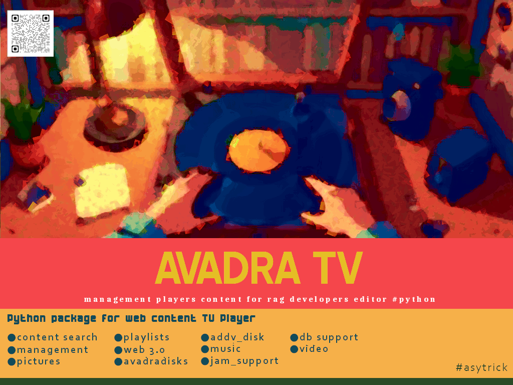

# AVADRA TV 📺✨  

Python Package for AVADRATV content RAG Music Management Player for GTK+ Widget Releases

_A Python-Powered Web3.0 Multimedia Engine for AI-Powered TV Experiences_



**AVADRA TV** is a content management platform and player built for **RAG developers** and **GEN-AI engineers**, enabling the creation, search, and distribution of multimedia content using a web-native, Python-based stack with full Web3.0 support for deploy players and eletronics players with web capabillities onboard.

> _“This is a part of a software suite for RAG Developers and GEN-AI Engineers – composed within the CineOS Barsotti ecosystem @BuskPlay – Unix Like.”_

---

## 📦 Features

- 🎞️ **Web3.0 TV Player Engine** – Create dynamic multimedia playlists and stream audio/video content.
- 🔍 **AI-Driven Search & Ranking** – Leverage embedded Web3.0 databases for persistent, measurable content operations.
- 💽 **avadra.tvddr Disk Support** – Install and mount AVADRA-specific multimedia drives using `addv_disk`.
- 🖼️ **Visual Viewer** – Supports image-based content, generative art, and HQ visuals.
- 📡 **Jam Support** – Transmit live sessions with QR-code invites and collaborative mode.
- 📈 **Pipeline Manager** – Content management and AI model appending system for player customization.
- 🔁 **Export & Backup** – Manage your database versions with `avadradisks`.
- 🎧 **Open Audio Playback** – Supports streaming and playing open-license content.

---

## 📥 Installation

> **Coming soon via [PyPI](https://pypi.org/):**

```bash
# pip install avadra_tv_v1 [ obs:underconstruction please wait for release - have a nice day ]
````

## 🛠️ Tech Stack

* **Language:** Python 3.x
* **Web:** HTML5 / WebView
* **Database:** Embedded Web3.0-ready engines
* **Interoperability:** Supports RAG pipelines and LLM integration
* **Environment:** Unix-like systems preferred or Crossover OS

---

## 📂 Core Modules

| Module        | Description                                |
| ------------- | ------------------------------------------ |
| `avadra_tv`   | Main player and UI logic                   |
| `db_support`  | Database persistence and ranking           |
| `addv_disk`   | Mount `.tvddr` files for content expansion |
| `jam_support` | Transmission, collaboration, QR invites    |
| `avadradisks` | Database backup/export system              |

---

## 🧪 Development Status

🚧 **This project is currently under development**.
Stay tuned for the first public release. Contributions and feedback are welcome!

---

## 📫 Contact

**Author:** #asytrick
📧 Email: [eusmool@gmail.com](mailto:eusmool@gmail.com)

---

> *AVADRA TV is a part of the CineOS project and aligned with global goals for decentralized AI-assisted broadcasting and generative creativity.*

---
